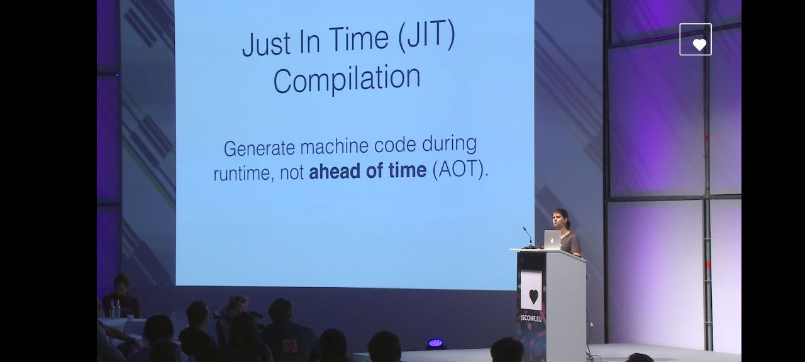
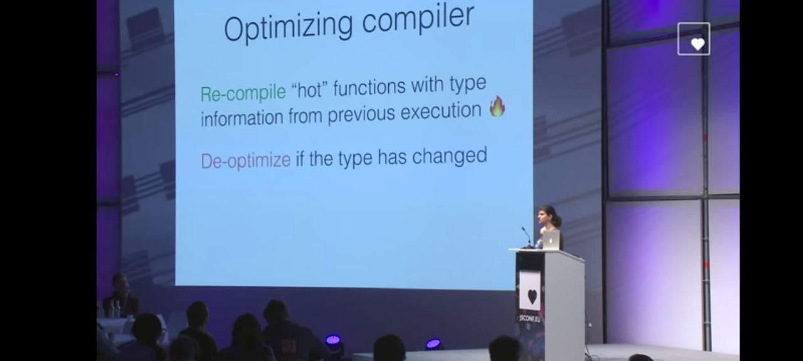
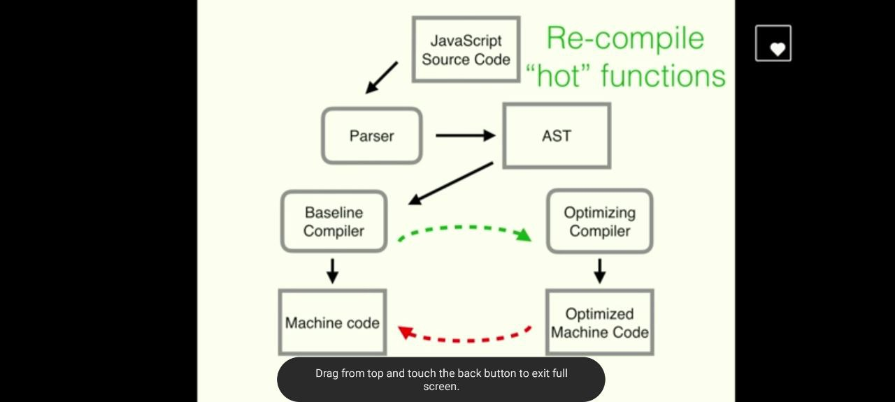
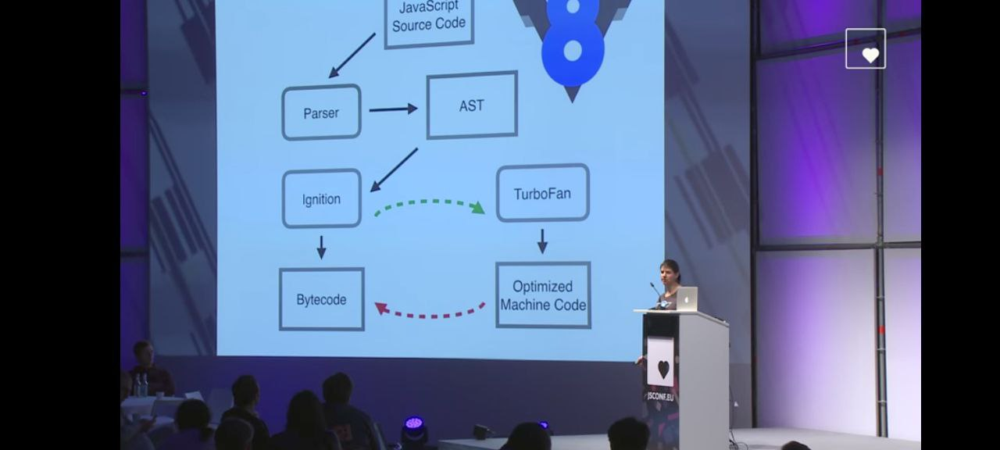
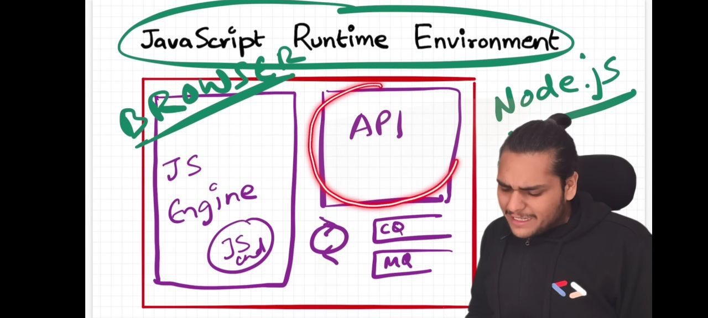
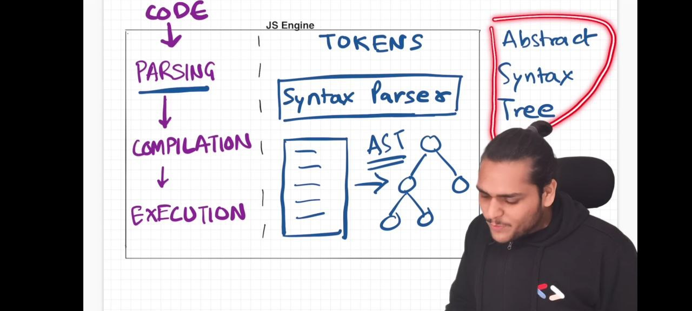
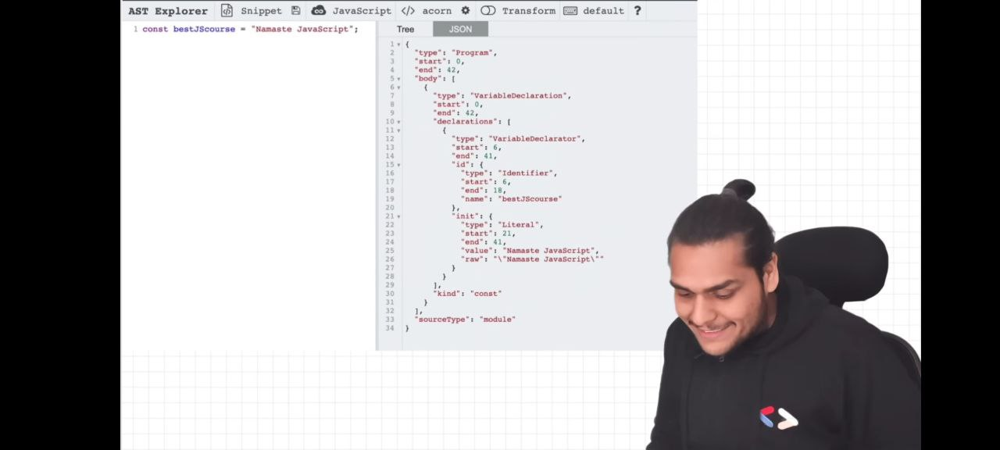
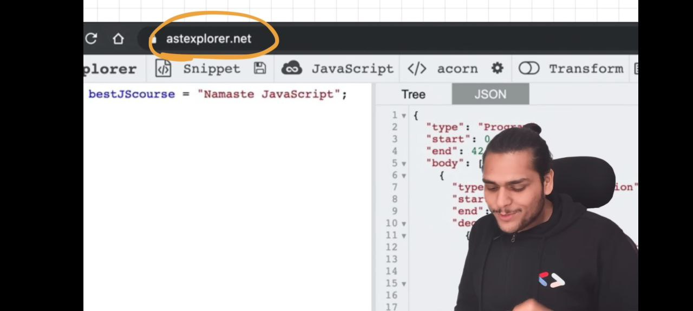
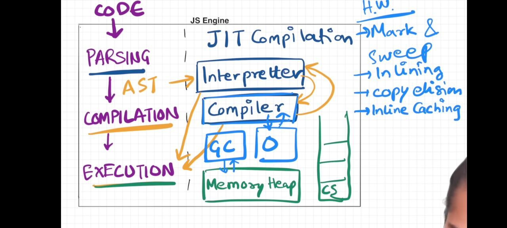
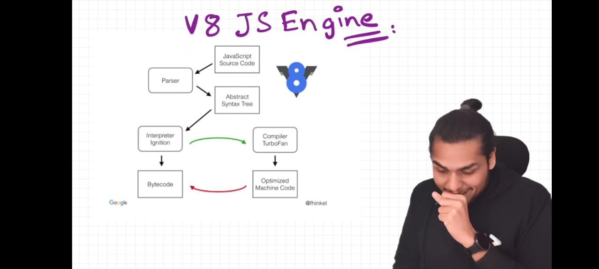

# JS Engine

### JS engine have not event loop, callback queue and other apis like HTTP, DOM ,setTimeout(), xmlhttprequest 

### JS environment {browser, nodejs } provide extra thing to js engine  

### note : interesting fact is that v8 engine have not -->DOM, setTimeout and other apis that we use with browser. when download source code of v8 engine these things not work by source code.

1  
2  
3  
4  
7  
8  
9  
10  
11  
12  
13  

